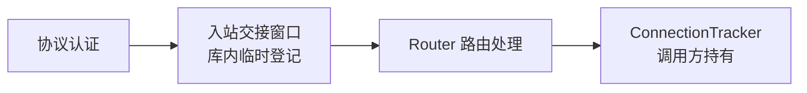

# sing-box-acp

`sing-box-acp` 是面向 ACP 场景维护的 sing-box Go 库分支，为嵌入式运行时提供入站用户热更新、凭据轮换和会话撤销能力。

本项目不是 SagerNet 官方发行版，也不代表或隶属于 SagerNet。仓库保留原项目的模块路径 `github.com/sagernet/sing-box`，以兼容现有 sing-box 包引用。

## 版本基线

| 组件 | 基线 |
| --- | --- |
| sing-box | `v1.13.16` |
| sing-quic | `d83826c306d7` |
| Go | `1.24.7` 或更高兼容版本 |

根模块通过 `replace` 将 `github.com/sagernet/sing-quic` 指向 [`third_party/sing-quic-acp`](third_party/sing-quic-acp)。该本地模块包含 Hysteria2 会话撤销所需的定制实现，集成时必须与主模块一起保留。

## 库能力

### 原子用户热更新

支持的协议入站可以在监听器持续运行时替换认证用户：

| 协议 | `UpdateUsers` | `CloseUserSessions` |
| --- | --- | --- |
| Trojan | 原子替换用户与密码快照 | 关闭该用户仍处于路由交接窗口的连接 |
| VLESS | 原子替换用户、UUID 与 Flow 快照 | 关闭该用户仍处于路由交接窗口的连接 |
| Hysteria2 | 原子替换用户与密码快照，并撤销失效凭据对应的会话 | 关闭该用户的完整 QUIC 传输会话 |

更新时会先构建并校验完整的新认证快照，再通过一次原子操作发布。无效或重复的用户数据不会覆盖当前认证状态，并发握手不会观察到半更新数据。

用户删除或凭据变化时，只撤销已经失效的身份。单纯调整用户顺序或添加其他用户，不会中断凭据仍然有效的会话。

### 连接所有权边界

Trojan 和 VLESS 在认证成功后，会暂时登记连接，直到 Router 完成嗅探、规则匹配并将连接交给 `adapter.ConnectionTracker`。这段时间称为“路由交接窗口”。



`CloseUserSessions` 只处理协议入站仍然拥有的资源：

- Trojan/VLESS：关闭交接窗口内的连接；
- Hysteria2：关闭对应用户的 QUIC 传输会话。

连接进入 `adapter.ConnectionTracker` 后，其生命周期归跟踪器实现方管理。需要关闭某个用户的全部存量连接时，调用方应先调用入站的 `CloseUserSessions`，再关闭自己通过 `ConnectionTracker` 登记的 TCP 和 UDP 连接。这个顺序可以避免连接在两个所有权阶段之间漏过撤销。

### 运行时入站管理

入站管理器支持在运行期间创建、替换和删除入站。替换同名入站时会先启动新实例，再关闭旧实例，减少切换期间的监听中断。

### 并发与生命周期保护

库内测试覆盖以下场景：

- 更新发布期间仍在进行的认证握手；
- 用户删除、密码轮换和 VLESS Flow 变化；
- 重复凭据导致的更新拒绝与状态回滚；
- 并发用户更新与认证检查；
- QUIC 主连接关闭后的 UDP 子会话清理；
- 路由交接窗口内的定向连接撤销。

## 集成

该分支继续声明原始模块路径。通过本地源码集成时，在调用方的 `go.mod` 中添加：

```mod
require github.com/sagernet/sing-box v1.13.16

replace github.com/sagernet/sing-box => ../sing-box-acp
```

路径应按实际目录结构调整。不要为本分支改写 import path。

协议能力使用结构化接口检测，不要求在 sing-box 公共 adapter 包中引入业务类型：

```go
type UserUpdater[T any] interface {
	UpdateUsers(users []T) error
}

type UserSessionCloser interface {
	CloseUserSessions(userID string) int
}
```

调用方可根据具体协议使用对应的 `option.*User` 类型断言 `UserUpdater[T]`，并通过 `UserSessionCloser` 撤销仍由入站持有的用户会话。

## 测试

运行主模块重点测试：

```bash
go test ./adapter/inbound ./protocol/hysteria2 ./protocol/trojan ./protocol/vless
```

运行定制 sing-quic 模块测试：

```bash
go -C third_party/sing-quic-acp test ./...
```

运行主模块完整测试：

```bash
go test ./...
```

`dns/transport/hosts` 测试会读取操作系统 hosts 文件，并要求其中存在有效的 `localhost` 映射。精简过的 Windows hosts 文件可能导致该环境相关测试失败。

## 关键目录

```text
adapter/inbound/                 运行时入站创建、替换和删除
protocol/trojan/                 Trojan 认证快照与交接窗口撤销
protocol/vless/                  VLESS 认证快照与交接窗口撤销
protocol/hysteria2/              Hysteria2 用户更新入口
third_party/sing-quic-acp/       QUIC 认证快照、会话撤销及测试
```

## 上游维护

- `upstream` 指向 `https://github.com/SagerNet/sing-box.git`；
- 升级 sing-box 基线时同步核对其要求的 sing-quic 版本；
- 先移植 sing-quic 上游变化，再重新应用并测试 ACP 定制；
- 不直接编辑生成文件，也不用上游模块覆盖 `third_party/sing-quic-acp`。

## 许可证

本项目基于 sing-box，并继续遵循仓库 [`LICENSE`](LICENSE) 中的许可与附加条款。`third_party/sing-quic-acp` 保留其上游许可证，详见该目录内的 `LICENSE` 和 `ACP_CHANGES.md`。
